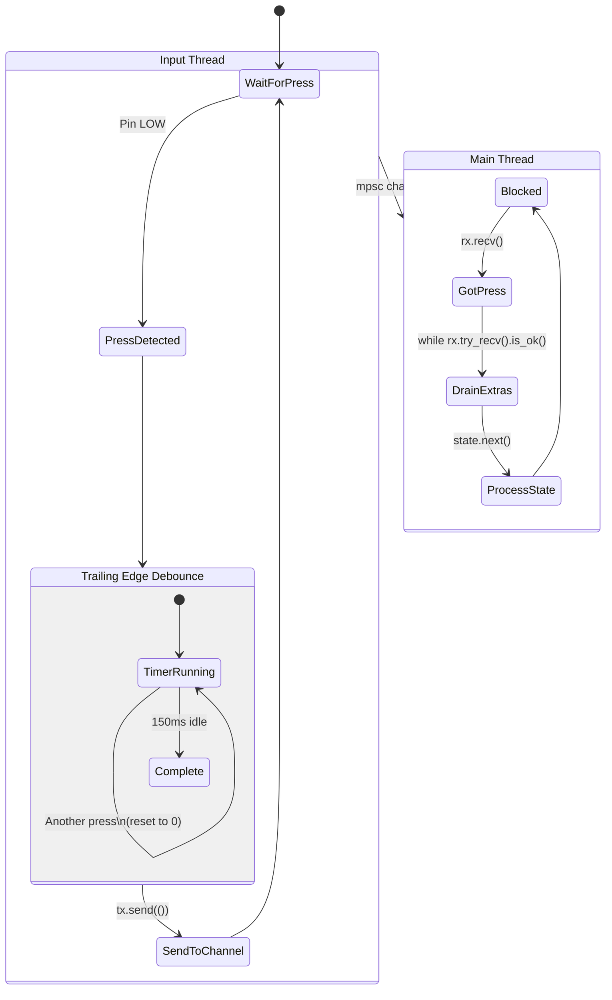
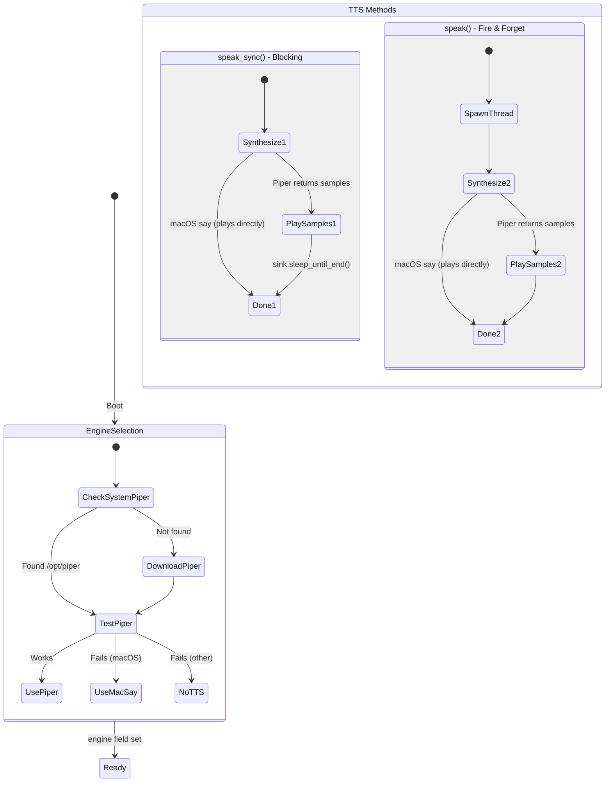
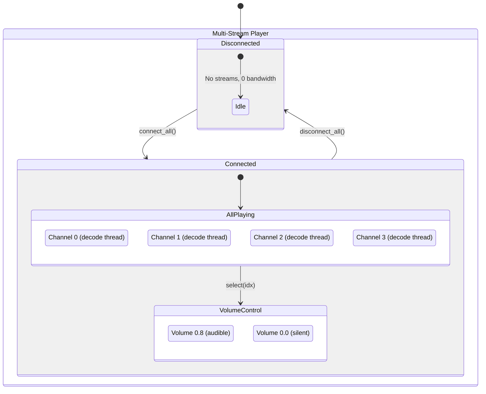
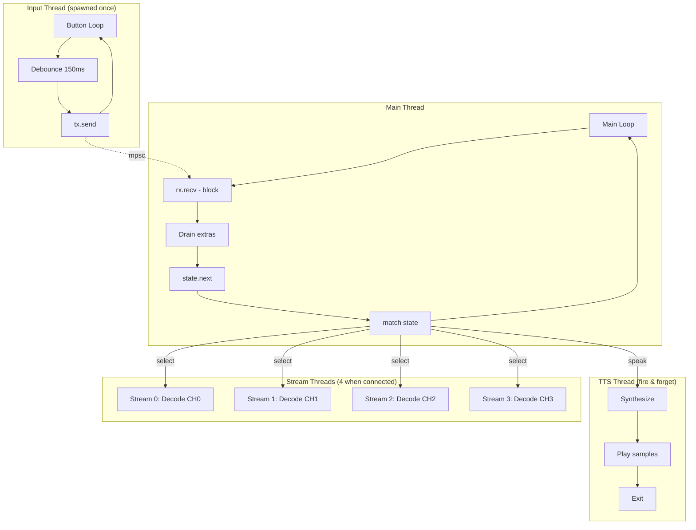

# LEGO Radio State Machine

## Overview

A simple internet radio with 4 channels, controlled by a single button. Press to cycle through:
`Welcome → Channel 1 → Channel 2 → Channel 3 → Channel 4 → Off → Welcome`

**Multi-Stream Architecture:** All 4 streams connect at boot and play simultaneously (but muted). Channel switching is instant - just a volume change. Off state disconnects all streams to save bandwidth.

## Main State Flow

```mermaid
stateDiagram-v2
    [*] --> Boot

    state Boot {
        [*] --> InitLogger
        InitLogger --> InitTTS: Downloads Piper if needed
        InitTTS --> InitAudio: Creates rodio output
        InitAudio --> SpawnInputThread: mpsc channel created
        SpawnInputThread --> [*]
    }

    Boot --> Welcome: Auto (no button press)

    state Welcome {
        [*] --> SayHello: "Hello!" (blocking)
        SayHello --> SayCheckingUpdates: "Checking for updates..." (blocking)
        SayCheckingUpdates --> CheckUpdates

        state UpdateCheck <<choice>>
        CheckUpdates --> UpdateCheck
        UpdateCheck --> Installing: Update available
        UpdateCheck --> UpToDate: No update

        Installing --> InstallResult

        state InstallResult <<choice>>
        InstallResult --> Exit: Success
        InstallResult --> PromptStart: Failure

        Exit --> [*]: process::exit(0)\nsystemd restarts
        UpToDate --> SayUpToDate: "Up to date." (blocking)
        SayUpToDate --> ConnectStreams
        ConnectStreams --> SayConnected: "Connecting to stations..." (blocking)
        SayConnected --> PromptStart: "Connected N out of 4 stations."
        PromptStart --> WaitForPress: "Change channel to start playing." (blocking)
        WaitForPress --> [*]
    }

    Welcome --> Playing: Button press → state.next()

    state Playing {
        [*] --> DuckAndAnnounce: speak() ducks all streams + TTS
        DuckAndAnnounce --> SelectChannel: select(idx) - instant volume switch

        state AllStreams {
            [*] --> Stream0: Muted (0.0) or Active (0.8)
            [*] --> Stream1: Muted (0.0) or Active (0.8)
            [*] --> Stream2: Muted (0.0) or Active (0.8)
            [*] --> Stream3: Muted (0.0) or Active (0.8)
        }

        SelectChannel --> AllStreams: Only active stream audible
        AllStreams --> [*]: Playing until button press
    }

    note right of Playing
        4 Channels (index 0-3):
        0. YLE Classical
        1. YLE Radio 1
        2. Soma Groove Salad
        3. Soma Drone Zone

        All streams connected,
        only one audible at a time
    end note

    Playing --> Playing: Button press\n(next channel)\nINSTANT switch
    Playing --> Off: Button press\n(after channel 3)

    state Off {
        [*] --> SayOff: "Radio off" (blocking)
        SayOff --> DisconnectAll: disconnect_all()
        DisconnectAll --> Idle: 0 bandwidth, 0 CPU
        Idle --> [*]
    }

    Off --> Welcome: Button press\n(reconnects all streams)
```

## RadioState Enum

The state machine uses an explicit enum instead of magic index numbers:

```rust
#[derive(Debug, Clone, Copy, PartialEq)]
enum RadioState {
    Welcome,
    Playing(usize),  // channel index 0..3
    Off,
}

impl RadioState {
    fn next(self, num_channels: usize) -> RadioState {
        match self {
            RadioState::Welcome => RadioState::Playing(0),
            RadioState::Playing(i) if i + 1 < num_channels => RadioState::Playing(i + 1),
            RadioState::Playing(_) => RadioState::Off,
            RadioState::Off => RadioState::Welcome,
        }
    }
}
```

**State Transitions (with 4 channels):**
```
Welcome → Playing(0) → Playing(1) → Playing(2) → Playing(3) → Off → Welcome
```

**Unit Tests:** 7 tests in `src/main.rs` verify all transitions including edge cases.

## Main Loop

```rust
// Welcome plays automatically on boot (connects all streams)
handle_welcome(&mut player, &tts);

loop {
    // 1. Block until button press
    rx.recv().ok();

    // 2. Drain queued presses (debounce overflow)
    while rx.try_recv().is_ok() { discarded += 1; }

    // 3. Transition to next state
    state = state.next(num_channels);

    // 4. Execute state action
    match state {
        RadioState::Welcome => handle_welcome(&mut player, &tts),
        RadioState::Playing(idx) => {
            player.speak(channel.tts_name, &tts);  // Duck + announce
            player.select(idx);                    // INSTANT switch
        },
        RadioState::Off => {
            player.speak_sync("Radio off", &tts);
            player.disconnect_all();               // Save bandwidth
        },
    }
}
```

## Button Input (Trailing Edge Debounce)



**Debounce Behavior:**
- Action registers only after user **stops pressing** for 150ms
- Rapid presses reset the timer (trailing edge)
- Prevents double-registration from mechanical bounce
- Constant: `INPUT_DEBOUNCE_MS = 150`

## TTS Subsystem



**TTS Engine Selection (checked once at boot):**
1. Try system-installed Piper (`/opt/piper` or `/usr/local/piper`)
2. Download Piper to `~/.local/share/lego-radio/`
3. Test Piper with "test" synthesis
4. Fall back to macOS `say` command if Piper fails (macOS only)
5. Store result in `engine` field (no runtime checks)

**TTS Methods:**
- `speak_sync()` - Blocking, waits for completion (welcome sequence, "Radio off")
- `speak()` - Fire-and-forget, spawns thread, **ducks ALL streams immediately** (channel announcements)

**Platform Differences:**
| Engine | Audio Output | Synthesis Time | Duck Timing |
|--------|--------------|----------------|-------------|
| Piper | rodio (same as stream) | 1-2s on Pi | ✅ Refreshed after synthesis |
| macOS `say` | macOS speech system | Immediate | ✅ Works correctly |

Duck timer is refreshed after Piper synthesis completes, ensuring all streams stay ducked during TTS playback regardless of synthesis time.

## Audio Subsystem (Multi-Stream)



### Connection Phase (Welcome State)

```rust
pub fn connect_all(&mut self, channels: &[Channel], timeout: Duration) -> usize {
    // 1. Spawn 4 threads in parallel
    // 2. Each thread: HTTP connect + format probe + create decoder
    // 3. Wait for all with 10 second timeout
    // 4. Return count of successfully connected streams
}
```

All streams start **muted** (volume 0.0). Only when `select(idx)` is called does one become audible.

### Channel Switching (Instant)

```rust
pub fn select(&mut self, index: usize) {
    for (i, stream) in self.streams.iter().enumerate() {
        let volume = if i == index { VOLUME } else { 0.0 };
        stream.sink.set_volume(volume);
    }
    self.active_index = Some(index);
}
```

**No HTTP connect, no buffering delay** - just a volume change.

### Stream Ducking (All Streams)

- `speak()` sets `duck_until_ms = now + 1500ms`
- ALL 4 streams check this timestamp every decode loop iteration
- Active stream: volume = 10% (ducked) or 80% (normal)
- Inactive streams: always volume = 0.0 (muted)

### Disconnection (Off State)

```rust
pub fn disconnect_all(&mut self) {
    // 1. Set stop_flag for all 4 streams
    // 2. Wait for all threads to finish
    // 3. Clear stream handles
    // Result: 0 bandwidth, 0 CPU
}
```

### Error Recovery

When a stream fails mid-playback:
1. Detect error in decode loop
2. If active stream: TTS "Reconnecting..."
3. Spawn reconnect thread with exponential backoff (1s, 2s, 4s)
4. On success: resume playback
5. On failure after 3 retries: TTS "Station unavailable"

## Concurrency Model



**Thread Summary:**
| Thread | Lifetime | Purpose |
|--------|----------|---------|
| Main | Forever | State machine, blocking on rx.recv() |
| Input | Forever | Debounce button, send to channel |
| Stream 0-3 | While connected | Decode and play audio packets (4 threads) |
| TTS | Per speak() | Synthesize and play announcement |

## Resource Usage

**When Connected (Playing or switching channels):**
| Resource | Usage |
|----------|-------|
| Threads | 6 (main + input + 4 streams) |
| CPU | ~15-20% on Pi 4 (4 decoders) |
| Bandwidth | ~512 kbps (4 × 128 kbps) |
| Memory | ~12-48 MB (thread stacks + decoders) |

**When Disconnected (Off state):**
| Resource | Usage |
|----------|-------|
| Threads | 2 (main + input) |
| CPU | ~0% |
| Bandwidth | 0 |
| Memory | ~2 MB |

**Target Hardware:** Raspberry Pi 4 (2GB+ RAM recommended)

## Constants

| Constant | Value | Location | Purpose |
|----------|-------|----------|---------|
| `INPUT_DEBOUNCE_MS` | 150 | button.rs | Trailing edge debounce |
| `DUCK_DURATION_MS` | 1500 | audio.rs | How long streams stay ducked |
| `DUCKED_VOLUME` | 0.1 | audio.rs | Volume during ducking |
| `VOLUME` | 0.8 | audio.rs | Normal playback volume |
| `MUTED_VOLUME` | 0.0 | audio.rs | Volume for inactive streams |
| `CONNECT_TIMEOUT` | 10s | audio.rs | Max time to wait for stream connect |

## Channels

Defined in `src/channels.rs`:

| Index | Name | TTS Name | URL |
|-------|------|----------|-----|
| 0 | YLE Klassinen | Y L E Classical | icecast.live.yle.fi |
| 1 | YLE Radio 1 | Y L E Radio 1 | icecast.live.yle.fi |
| 2 | Soma FM Groove Salad | Soma Groove Salad | ice1.somafm.com |
| 3 | Soma FM Drone Zone | Soma Drone Zone | ice1.somafm.com |

TTS names spell out abbreviations for natural speech.
