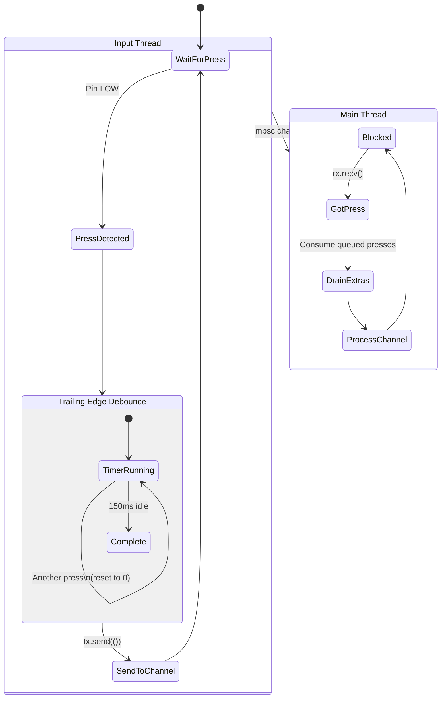
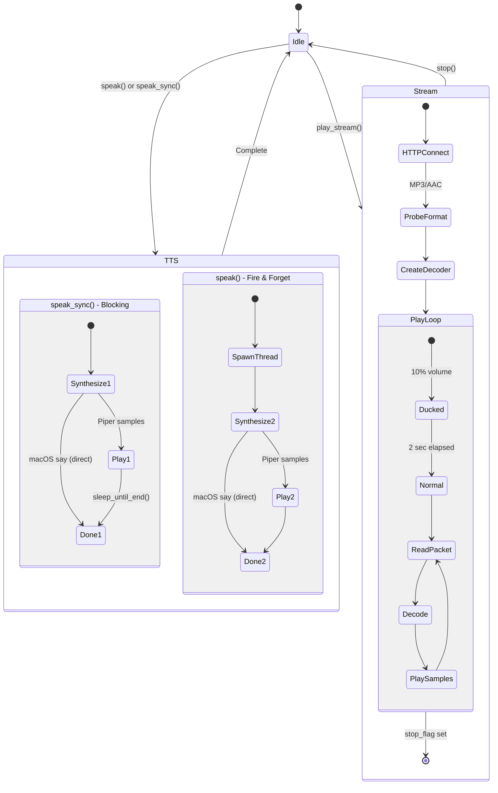
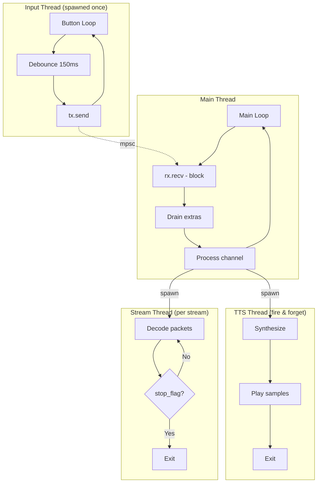

# LEGO Radio State Machine

## Main State Flow

```mermaid
stateDiagram-v2
    [*] --> Boot

    state Boot {
        [*] --> InitLogger
        InitLogger --> InitTTS
        InitTTS --> InitAudio
        InitAudio --> SpawnInputThread
        SpawnInputThread --> [*]
    }

    Boot --> Welcome: Auto (handle_welcome called)

    state Welcome {
        [*] --> SayHello: "Hello!"
        SayHello --> CheckUpdates: "Checking for updates..."

        state UpdateCheck <<choice>>
        CheckUpdates --> UpdateCheck
        UpdateCheck --> Installing: Update available
        UpdateCheck --> UpToDate: No update

        Installing --> InstallResult

        state InstallResult <<choice>>
        InstallResult --> Exit: Success
        InstallResult --> PromptStart: Failure

        Exit --> [*]: process::exit(0)\nsystemd restarts
        UpToDate --> PromptStart: "Up to date"
        PromptStart --> WaitForPress: "Press button to start"
        WaitForPress --> [*]
    }

    Welcome --> Playing: Button press

    state Playing {
        [*] --> StopPrevious: stop() if streaming
        StopPrevious --> AnnounceChannel: speak() fire-and-forget
        AnnounceChannel --> StartStream: play_stream()

        state StreamLoop {
            [*] --> Ducked: Volume 10%
            Ducked --> Normal: After 2 seconds
            Normal --> DecodeLoop
            DecodeLoop --> DecodeLoop: Read/decode/play packets
        }

        StartStream --> StreamLoop
        StreamLoop --> [*]: Playing until button press
    }

    note right of Playing
        Channels 1-4:
        1. YLE Classical
        2. YLE Radio 1
        3. Soma Groove Salad
        4. Soma Drone Zone
    end note

    Playing --> Playing: Button press\n(next channel)
    Playing --> Off: Button press\n(after last channel)

    state Off {
        [*] --> StopStream: stop()
        StopStream --> SayOff: "Radio off"
        SayOff --> Idle
        Idle --> [*]
    }

    Off --> Welcome: Button press
```

## State Machine (Enum)

The code uses a `RadioState` enum for explicit state management:

```rust
enum RadioState {
    Welcome,
    Playing(usize),  // channel index 0..N-1
    Off,
}

impl RadioState {
    fn next(self, num_channels: usize) -> RadioState {
        match self {
            Welcome => Playing(0),
            Playing(i) if i + 1 < num_channels => Playing(i + 1),
            Playing(_) => Off,
            Off => Welcome,
        }
    }
}
```

**State Transitions:**
```
Welcome → Playing(0) → Playing(1) → Playing(2) → Playing(3) → Off → Welcome
```

**On startup:** `handle_welcome()` is called immediately, then the loop waits for button presses.

## Button Input (Debounce)



**Debounce behavior:** Action only registers after user stops pressing for 150ms. Rapid presses reset the timer.

## Audio Subsystem



## Concurrency Model



## Implementation Notes

**Completed simplifications:**
- Replaced integer state with `RadioState` enum
- Removed `pending_press` variable - welcome handled on startup
- Removed redundant `stop()` call in channel switch
- Extracted `handle_welcome()` function for clarity

See `docs/improvements.md` for remaining improvement ideas.
