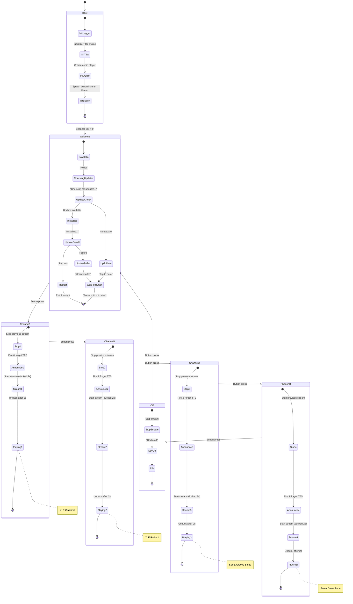
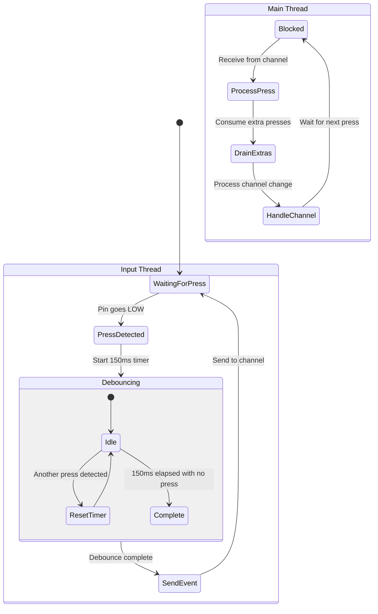
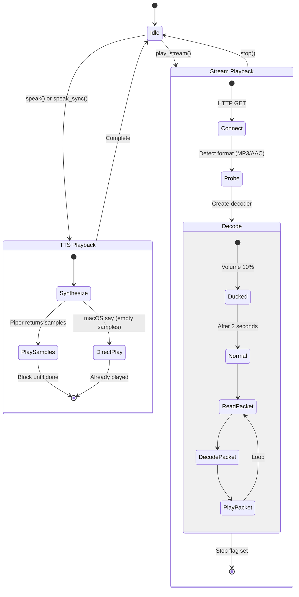
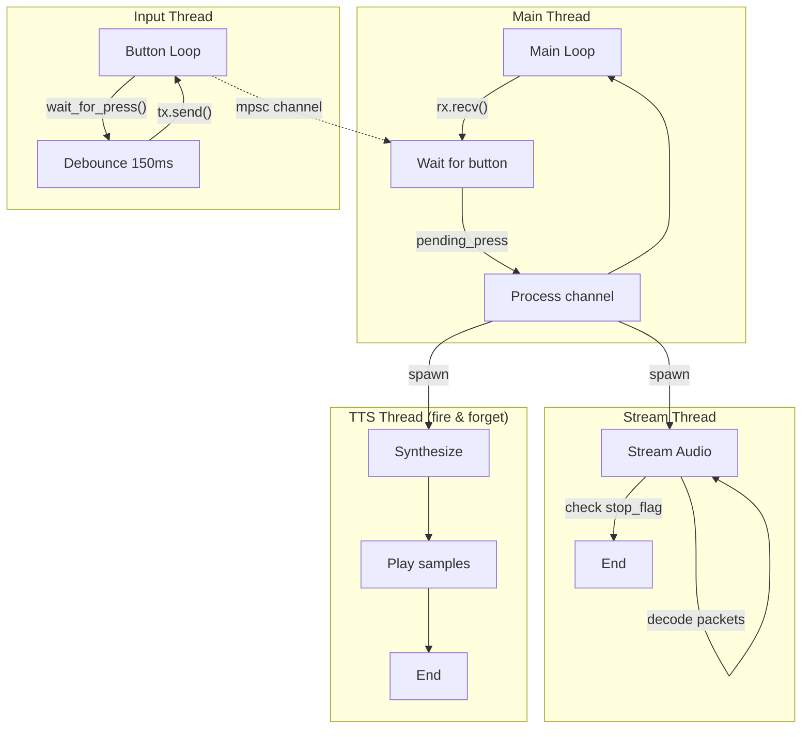

# LEGO Radio State Machine

## Main State Flow



## Button Input Handling



## Audio Subsystem



## Channel Index Logic

```
channel_idx | State
------------|------------------
-1          | Initial (before first iteration)
 0          | Welcome sequence
 1          | Channel 1 (YLE Classical)
 2          | Channel 2 (YLE Radio 1)
 3          | Channel 3 (Soma Groove Salad)
 4          | Channel 4 (Soma Drone Zone)
 5          | Radio Off
 6+         | Wraps to Welcome (0)
```

## Concurrency Model


