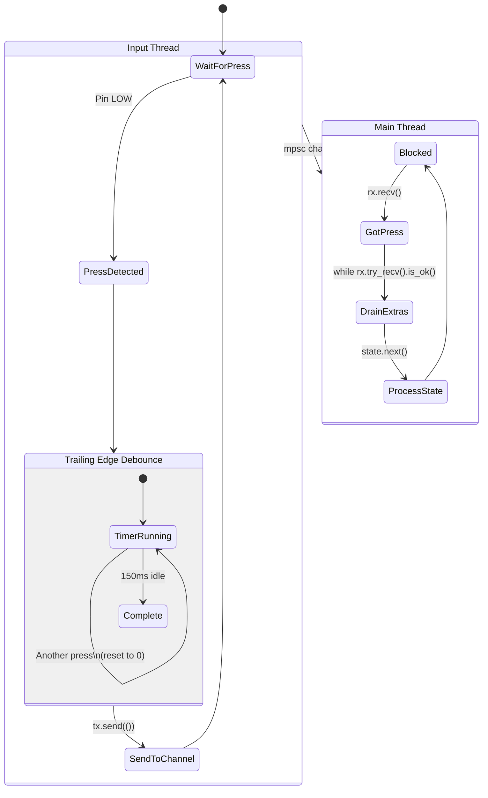
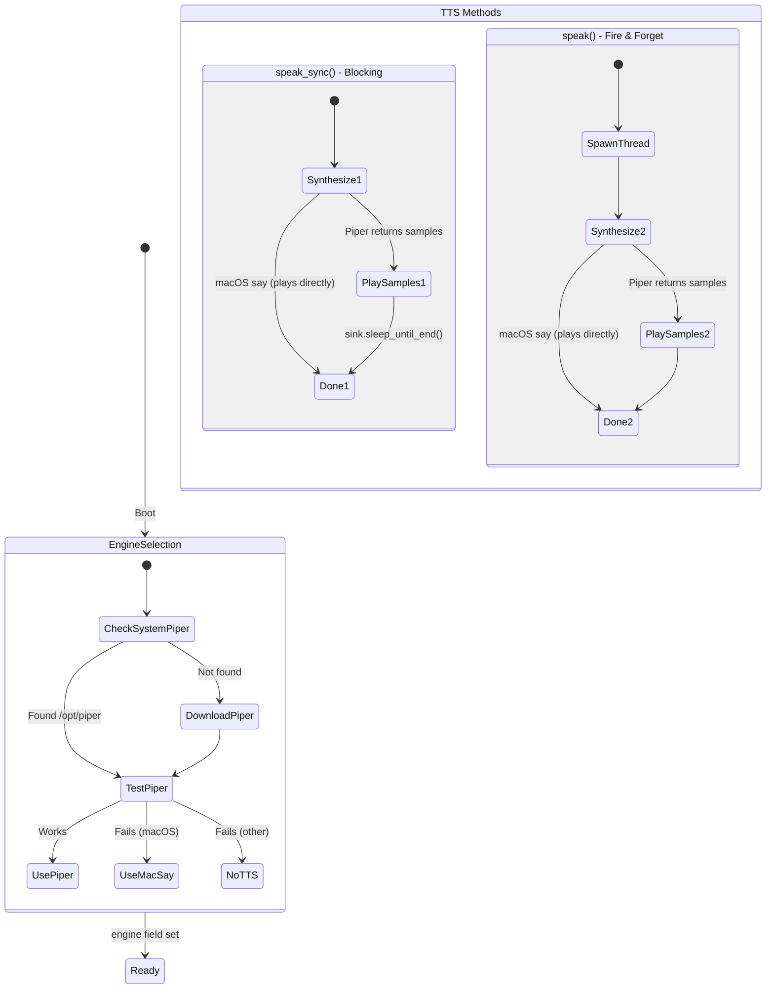
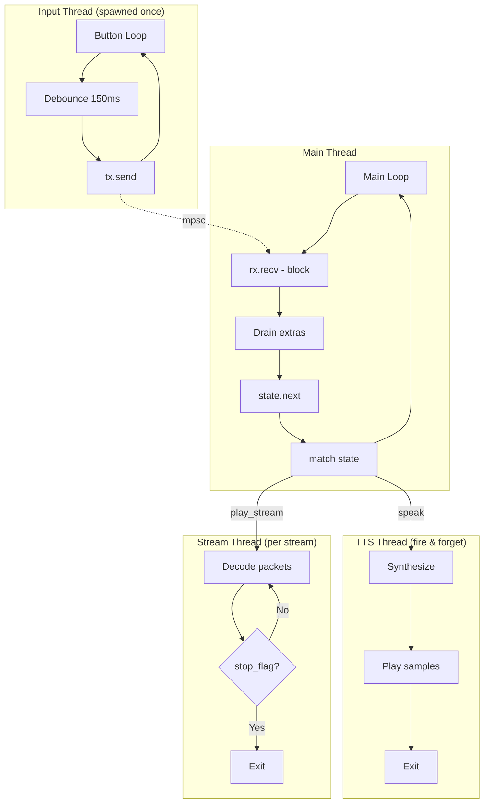

# LEGO Radio State Machine

## Overview

A simple internet radio with 4 channels, controlled by a single button. Press to cycle through:
`Welcome → Channel 1 → Channel 2 → Channel 3 → Channel 4 → Off → Welcome`

## Main State Flow

```mermaid
stateDiagram-v2
    [*] --> Boot

    state Boot {
        [*] --> InitLogger
        InitLogger --> InitTTS: Downloads Piper if needed
        InitTTS --> InitAudio: Creates rodio output
        InitAudio --> SpawnInputThread: mpsc channel created
        SpawnInputThread --> [*]
    }

    Boot --> Welcome: Auto (no button press)

    state Welcome {
        [*] --> SayHello: "Hello!" (blocking)
        SayHello --> SayCheckingUpdates: "Checking for updates..." (blocking)
        SayCheckingUpdates --> CheckUpdates

        state UpdateCheck <<choice>>
        CheckUpdates --> UpdateCheck
        UpdateCheck --> Installing: Update available
        UpdateCheck --> UpToDate: No update

        Installing --> InstallResult

        state InstallResult <<choice>>
        InstallResult --> Exit: Success
        InstallResult --> PromptStart: Failure

        Exit --> [*]: process::exit(0)\nsystemd restarts
        UpToDate --> SayUpToDate: "Up to date." (blocking)
        SayUpToDate --> PromptStart
        PromptStart --> WaitForPress: "Change channel to start playing." (blocking)
        WaitForPress --> [*]
    }

    Welcome --> Playing: Button press → state.next()

    state Playing {
        [*] --> DuckAndAnnounce: speak() ducks all streams + TTS
        DuckAndAnnounce --> StopPrevious: play_stream() calls stop()
        StopPrevious --> StartStream: Start new stream

        state StreamLoop {
            [*] --> CheckDuck: Check duck_until_ms
            CheckDuck --> Ducked: now < duck_until
            CheckDuck --> Normal: now >= duck_until
            Ducked --> DecodeLoop: 10% volume
            Normal --> DecodeLoop: 80% volume
            DecodeLoop --> CheckDuck: Loop
        }

        StartStream --> StreamLoop
        StreamLoop --> [*]: Playing until button press
    }

    note right of Playing
        4 Channels (index 0-3):
        0. YLE Classical
        1. YLE Radio 1
        2. Soma Groove Salad
        3. Soma Drone Zone
    end note

    Playing --> Playing: Button press\n(next channel)
    Playing --> Off: Button press\n(after channel 3)

    state Off {
        [*] --> StopStream: stop() - waits for thread
        StopStream --> SayOff: "Radio off" (blocking)
        SayOff --> Idle
        Idle --> [*]
    }

    Off --> Welcome: Button press
```

## RadioState Enum

The state machine uses an explicit enum instead of magic index numbers:

```rust
#[derive(Debug, Clone, Copy, PartialEq)]
enum RadioState {
    Welcome,
    Playing(usize),  // channel index 0..3
    Off,
}

impl RadioState {
    fn next(self, num_channels: usize) -> RadioState {
        match self {
            RadioState::Welcome => RadioState::Playing(0),
            RadioState::Playing(i) if i + 1 < num_channels => RadioState::Playing(i + 1),
            RadioState::Playing(_) => RadioState::Off,
            RadioState::Off => RadioState::Welcome,
        }
    }
}
```

**State Transitions (with 4 channels):**
```
Welcome → Playing(0) → Playing(1) → Playing(2) → Playing(3) → Off → Welcome
```

**Unit Tests:** 7 tests in `src/main.rs` verify all transitions including edge cases.

## Main Loop

```rust
// Welcome plays automatically on boot
handle_welcome(&mut player, &tts);

loop {
    // 1. Block until button press
    rx.recv().ok();

    // 2. Drain queued presses (debounce overflow)
    while rx.try_recv().is_ok() { discarded += 1; }

    // 3. Transition to next state
    state = state.next(num_channels);

    // 4. Execute state action
    match state {
        RadioState::Welcome => handle_welcome(&mut player, &tts),
        RadioState::Playing(idx) => { /* announce + stream */ },
        RadioState::Off => { /* stop + announce */ },
    }
}
```

## Button Input (Trailing Edge Debounce)



**Debounce Behavior:**
- Action registers only after user **stops pressing** for 150ms
- Rapid presses reset the timer (trailing edge)
- Prevents double-registration from mechanical bounce
- Constant: `INPUT_DEBOUNCE_MS = 150`

## TTS Subsystem



**TTS Engine Selection (checked once at boot):**
1. Try system-installed Piper (`/opt/piper` or `/usr/local/piper`)
2. Download Piper to `~/.local/share/lego-radio/`
3. Test Piper with "test" synthesis
4. Fall back to macOS `say` command if Piper fails
5. Store result in `engine` field (no runtime checks)

**TTS Methods:**
- `speak_sync()` - Blocking, waits for completion (welcome sequence, "Radio off")
- `speak()` - Fire-and-forget, spawns thread, **ducks all streams immediately** (channel announcements)

## Audio Subsystem

```mermaid
stateDiagram-v2
    [*] --> Idle

    state "Stream Playback" as Stream {
        [*] --> StopExisting: stop() called by play_stream()
        StopExisting --> HTTPConnect: ureq::get()
        HTTPConnect --> ProbeFormat: symphonia probe
        ProbeFormat --> CreateDecoder
        CreateDecoder --> PlayLoop

        state PlayLoop {
            [*] --> CheckDuck
            CheckDuck --> SetDucked: now < duck_until_ms
            CheckDuck --> SetNormal: now >= duck_until_ms
            SetDucked --> CheckStop: volume 10%
            SetNormal --> CheckStop: volume 80%
            CheckStop --> ReadPacket: !stop_flag
            CheckStop --> Exit: stop_flag set
            ReadPacket --> Decode: symphonia
            Decode --> PlaySamples: rodio sink.append()
            PlaySamples --> CheckDuck
        }

        PlayLoop --> [*]: Stream ends or stopped
    }

    Idle --> Stream: play_stream(url)
    Stream --> Idle: stop() or error
```

**Stream Ducking (shared timestamp):**
- `speak()` sets `duck_until_ms = now + 1500ms`
- ALL streams check this timestamp every decode loop iteration
- If `now < duck_until_ms`: volume = 10% (ducked)
- If `now >= duck_until_ms`: volume = 80% (normal)
- This means ducking affects the **current** stream immediately when TTS starts

**Stop Behavior:**
- `stop()` sets `stop_flag` and calls `handle.join()`
- Waits for stream thread to actually finish before returning
- Creates new `stop_flag` for next stream

## Concurrency Model



**Thread Summary:**
| Thread | Lifetime | Purpose |
|--------|----------|---------|
| Main | Forever | State machine, blocking on rx.recv() |
| Input | Forever | Debounce button, send to channel |
| Stream | Per stream | Decode and play audio packets |
| TTS | Per speak() | Synthesize and play announcement |

## Constants

| Constant | Value | Location | Purpose |
|----------|-------|----------|---------|
| `INPUT_DEBOUNCE_MS` | 150 | button.rs | Trailing edge debounce |
| `DUCK_DURATION_MS` | 1500 | audio.rs | How long streams stay ducked |
| `DUCKED_VOLUME` | 0.1 | audio.rs | Volume during ducking |
| `VOLUME` | 0.8 | audio.rs | Normal playback volume |

## Channels

Defined in `src/channels.rs`:

| Index | Name | TTS Name | URL |
|-------|------|----------|-----|
| 0 | YLE Klassinen | Y L E Classical | icecast.live.yle.fi |
| 1 | YLE Radio 1 | Y L E Radio 1 | icecast.live.yle.fi |
| 2 | Soma FM Groove Salad | Soma Groove Salad | ice1.somafm.com |
| 3 | Soma FM Drone Zone | Soma Drone Zone | ice1.somafm.com |

TTS names spell out abbreviations for natural speech.
