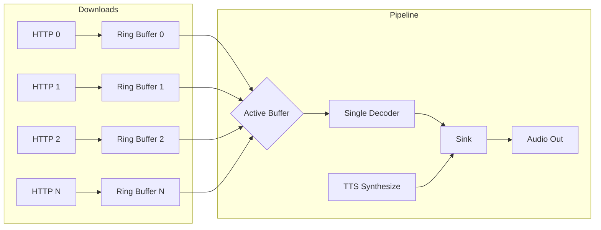
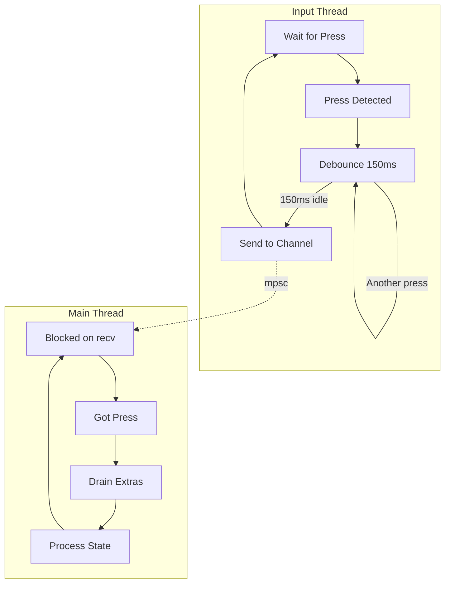
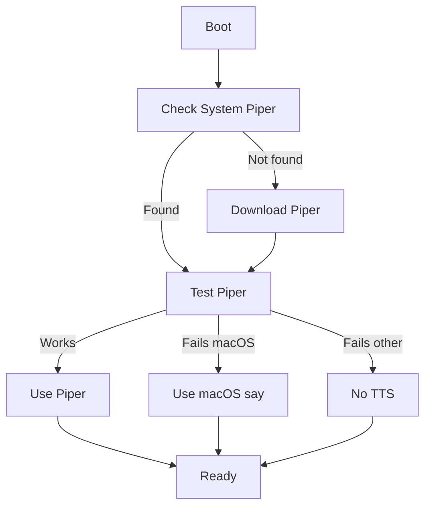
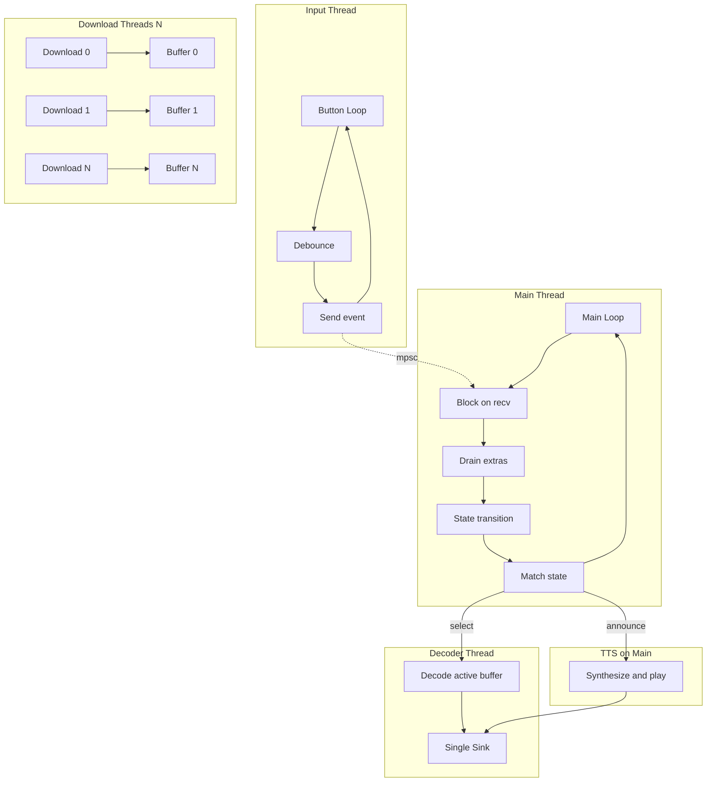
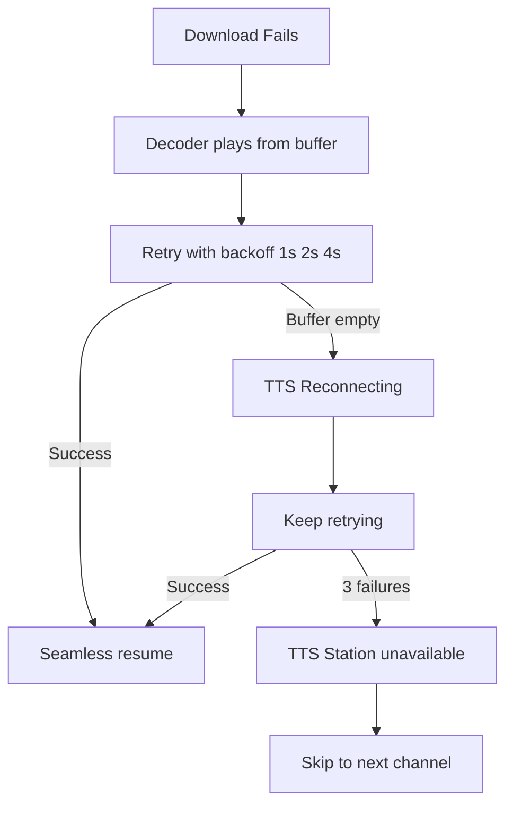

# LEGO Radio State Machine

## Overview

A simple internet radio with N channels, controlled by a single button. Press to cycle through:
`Welcome → Channel 1 → Channel 2 → ... → Channel N → Off → Welcome`

**Single-Pipe Architecture:** All streams download continuously into ring buffers, but only ONE decoder runs at a time, feeding a single audio output. Channel switching just changes which buffer the decoder reads from. TTS writes to the same output pipe. No muting needed.

## Architecture



**Key Properties:**
- HTTP downloads run continuously (bandwidth for N streams)
- Only ONE decoder active at a time (CPU for 1 stream)
- Single audio sink (no volume juggling)
- TTS is just another audio source to the same pipe
- Channel switch = point decoder at different buffer

## Main State Flow

```mermaid
stateDiagram-v2
    [*] --> Boot

    state Boot {
        [*] --> InitLogger
        InitLogger --> InitTTS
        InitTTS --> InitAudio
        InitAudio --> SpawnInputThread
        SpawnInputThread --> [*]
    }

    Boot --> Welcome

    state Welcome {
        [*] --> SayHello
        SayHello --> SayCheckingUpdates
        SayCheckingUpdates --> CheckUpdates

        state UpdateCheck <<choice>>
        CheckUpdates --> UpdateCheck
        UpdateCheck --> Installing : Update available
        UpdateCheck --> UpToDate : No update

        Installing --> InstallResult

        state InstallResult <<choice>>
        InstallResult --> Exit : Success
        InstallResult --> PromptStart : Failure

        Exit --> [*]
        UpToDate --> SayUpToDate
        SayUpToDate --> StartDownloads
        StartDownloads --> SayConnected
        SayConnected --> PromptStart
        PromptStart --> WaitForPress
        WaitForPress --> [*]
    }

    Welcome --> Playing : Button press

    state Playing {
        [*] --> Announce
        Announce --> SwitchBuffer
        SwitchBuffer --> Playback
        Playback --> [*]
    }

    Playing --> Playing : Next channel
    Playing --> Off : After last channel

    state Off {
        [*] --> StopDecoder
        StopDecoder --> SayOff
        SayOff --> StopDownloads
        StopDownloads --> Idle
        Idle --> [*]
    }

    Off --> Welcome : Button press
```



## RadioState Enum

```rust
#[derive(Debug, Clone, Copy, PartialEq)]
enum RadioState {
    Welcome,
    Playing(usize),  // channel index 0..N-1
    Off,
}

impl RadioState {
    fn next(self, num_channels: usize) -> RadioState {
        match self {
            RadioState::Welcome => RadioState::Playing(0),
            RadioState::Playing(i) if i + 1 < num_channels => RadioState::Playing(i + 1),
            RadioState::Playing(_) => RadioState::Off,
            RadioState::Off => RadioState::Welcome,
        }
    }
}
```

**State Transitions (with 4 channels):**
```
Welcome → Playing(0) → Playing(1) → Playing(2) → Playing(3) → Off → Welcome
```

## Main Loop

```rust
// Welcome plays automatically on boot
handle_welcome(&mut player, &tts);

loop {
    // 1. Block until button press
    rx.recv().ok();

    // 2. Drain queued presses (debounce overflow)
    while rx.try_recv().is_ok() { discarded += 1; }

    // 3. Transition to next state
    state = state.next(num_channels);

    // 4. Execute state action
    match state {
        RadioState::Welcome => handle_welcome(&mut player, &tts),
        RadioState::Playing(idx) => {
            player.announce(channel.tts_name, &tts);  // TTS to pipe
            player.select(idx);                       // Switch buffer
        },
        RadioState::Off => {
            player.stop();                            // Stop decoder
            player.announce("Radio off", &tts);       // TTS to pipe
            player.disconnect_all();                  // Stop downloads
        },
    }
}
```

## Audio Subsystem (Single-Pipe)

### Components

```rust
pub struct AudioPipeline {
    /// Ring buffers for each channel (compressed audio, ~3 seconds)
    buffers: Vec<RingBuffer>,

    /// Download threads (one per channel)
    downloaders: Vec<DownloadHandle>,

    /// Single decoder thread (reads from active buffer)
    decoder: Option<DecoderHandle>,

    /// Single audio output
    sink: Sink,

    /// Which buffer the decoder reads from
    active_channel: Option<usize>,
}
```

### Ring Buffer

Each channel has a ring buffer storing ~3 seconds of compressed audio:

```rust
struct RingBuffer {
    data: [u8; BUFFER_SIZE],      // ~48KB for 3s @ 128kbps
    write_pos: AtomicUsize,       // Where downloader writes
    read_pos: AtomicUsize,        // Where decoder reads
}
```

**Properties:**
- Lock-free (atomic positions)
- Overwrites old data when full (live stream, no rewinding)
- Decoder finds sync point (MP3 frame / AAC sync word) on start

### Download Threads

One thread per channel, runs continuously while connected:

```rust
fn download_loop(url: &str, buffer: &RingBuffer, stop: &AtomicBool) {
    let response = ureq::get(url).call()?;
    let mut reader = response.into_reader();

    loop {
        if stop.load(Ordering::SeqCst) { break; }

        let bytes_read = reader.read(&mut chunk)?;
        buffer.write(&chunk[..bytes_read]);  // Overwrites old data
    }
}
```

### Single Decoder

Only one decoder runs at a time:

```rust
fn decode_loop(buffer: &RingBuffer, sink: &Sink, stop: &AtomicBool) {
    let source = MediaSourceStream::new(buffer.as_reader());
    let decoder = symphonia::probe(&source)?;

    loop {
        if stop.load(Ordering::SeqCst) { break; }

        let packet = decoder.next_packet()?;
        let samples = decode_packet(packet);
        sink.append(samples);
    }
}
```

### Channel Switching

```rust
pub fn select(&mut self, index: usize) {
    // 1. Stop current decoder (if any)
    if let Some(handle) = self.decoder.take() {
        handle.stop_flag.store(true, Ordering::SeqCst);
        handle.thread.join().ok();
    }

    // 2. Start new decoder from selected buffer
    let buffer = &self.buffers[index];
    self.decoder = Some(spawn_decoder(buffer, &self.sink));

    self.active_channel = Some(index);
}
```

**Switch latency:** ~100-200ms (find sync point + decode first frame)

### TTS Integration

TTS writes directly to the same sink:

```rust
pub fn announce(&mut self, text: &str, tts: &PiperTts) {
    // 1. Pause decoder (stop writing to sink)
    if let Some(ref handle) = self.decoder {
        handle.pause();
    }

    // 2. Synthesize and play TTS
    let samples = tts.synthesize(text)?;
    self.sink.append(SamplesBuffer::new(1, 22050, samples));
    self.sink.sleep_until_end();

    // 3. Resume decoder
    if let Some(ref handle) = self.decoder {
        handle.resume();
    }
}
```

**No muting needed** - decoder simply pauses while TTS plays.

### Connection Phase

```rust
pub fn connect_all(&mut self, channels: &[Channel], timeout: Duration) -> usize {
    // Spawn download threads in parallel
    for (i, channel) in channels.iter().enumerate() {
        let buffer = &self.buffers[i];
        self.downloaders[i] = spawn_downloader(channel.url, buffer);
    }

    // Wait for buffers to fill (~3 seconds of data)
    wait_for_buffers(&self.buffers, timeout);

    // Return count of connected streams
    self.downloaders.iter().filter(|d| d.is_connected()).count()
}
```

### Disconnection

```rust
pub fn disconnect_all(&mut self) {
    // Stop decoder
    if let Some(handle) = self.decoder.take() {
        handle.stop();
    }

    // Stop all downloaders
    for downloader in &mut self.downloaders {
        downloader.stop();
    }

    // Clear buffers
    for buffer in &mut self.buffers {
        buffer.clear();
    }

    self.active_channel = None;
}
```

## Button Input (Trailing Edge Debounce)



**Debounce Behavior:**
- Action registers only after user **stops pressing** for 150ms
- Rapid presses reset the timer (trailing edge)
- Prevents double-registration from mechanical bounce
- Constant: `INPUT_DEBOUNCE_MS = 150`

## TTS Subsystem



**TTS Engine Selection (checked once at boot):**
1. Try system-installed Piper (`/opt/piper` or `/usr/local/piper`)
2. Download Piper to `~/.local/share/lego-radio/`
3. Test Piper with "test" synthesis
4. Fall back to macOS `say` command if Piper fails (macOS only)
5. Store result in `engine` field (no runtime checks)

**Platform Differences:**
| Engine | Audio Output | Synthesis Time |
|--------|--------------|----------------|
| Piper | Same sink as stream | 1-2s on Pi |
| macOS `say` | macOS speech system | Immediate |

## Concurrency Model



**Thread Summary:**
| Thread | Lifetime | Purpose |
|--------|----------|---------|
| Main | Forever | State machine, blocking on recv |
| Input | Forever | Debounce button, send to channel |
| Download 0..N | While connected | HTTP download to ring buffer |
| Decoder | While playing | Decode from active buffer to sink |

## Resource Usage

**When Connected (Playing):**
| Resource | Usage (N channels) |
|----------|-------------------|
| Threads | 3 + N (main + input + decoder + N downloaders) |
| CPU | ~5-8% on Pi 4 (1 decoder + N network I/O) |
| Bandwidth | N x 128 kbps |
| Memory | ~2 MB + N x 48 KB (ring buffers) |

**Comparison with old multi-decode architecture:**
| Metric | Old (N decoders) | New (1 decoder) |
|--------|------------------|-----------------|
| CPU (4 ch) | ~15-20% | ~5-8% |
| CPU (10 ch) | ~40-50% | ~8-10% |
| Bandwidth | Same | Same |
| Switch latency | Instant | ~100-200ms |

**When Disconnected (Off state):**
| Resource | Usage |
|----------|-------|
| Threads | 2 (main + input) |
| CPU | ~0% |
| Bandwidth | 0 |
| Memory | ~2 MB |

**Target Hardware:** Raspberry Pi 4 (1GB+ RAM sufficient)

## Constants

| Constant | Value | Location | Purpose |
|----------|-------|----------|---------|
| `INPUT_DEBOUNCE_MS` | 150 | button.rs | Trailing edge debounce |
| `VOLUME` | 0.8 | audio.rs | Playback volume |
| `BUFFER_SECONDS` | 3 | audio.rs | Ring buffer size |
| `CONNECT_TIMEOUT` | 10s | audio.rs | Max time to wait for initial buffer fill |

## Channels

Defined in `src/channels.rs`:

| Index | Name | TTS Name | URL |
|-------|------|----------|-----|
| 0 | YLE Klassinen | Y L E Classical | icecast.live.yle.fi |
| 1 | YLE Radio 1 | Y L E Radio 1 | icecast.live.yle.fi |
| 2 | Soma FM Groove Salad | Soma Groove Salad | ice1.somafm.com |
| 3 | Soma FM Drone Zone | Soma Drone Zone | ice1.somafm.com |

TTS names spell out abbreviations for natural speech.

## Error Recovery



When a download fails:
1. Decoder continues playing from buffer (has ~3 seconds)
2. Download thread retries with exponential backoff (1s, 2s, 4s)
3. If still failing when buffer empties: TTS "Reconnecting..."
4. On success: seamless resume
5. On failure after 3 retries: TTS "Station unavailable", skip to next channel
